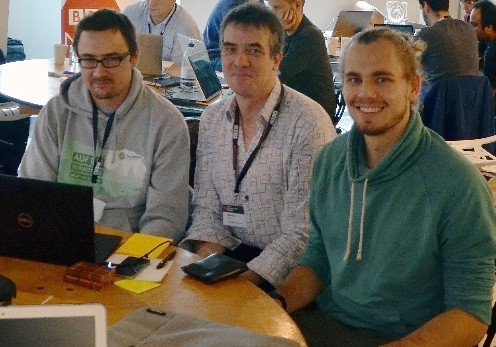

We are [Wolf](https://de.linkedin.com/in/wolf-pauw-a847a2123/de), [Martin](https://twitter.com/mvtango) & [Alex](https://twitter.com/_gobitodic) from dpa, the German Press Agency in Hamburg.

We are working for the newslab of the dpa and Buzzrank, our own Social Media Monitoring Tool. Don't hesitate to contact us!

[@BuzzRank](https://twitter.com/buzzrank)

[@dpa_newslab](https://twitter.com/dpa_newslab)

