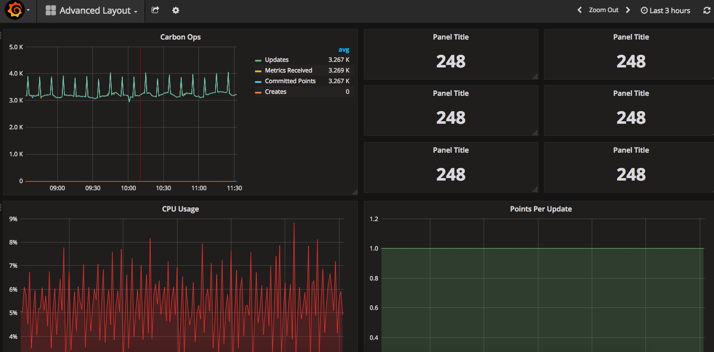

We had some great tools in mind that can be used with Elasticsearch - some of them are used for prototypes at the dpa newslab, like [Grafana](https://grafana.com/) and [Facetview](https://github.com/okfn/facetview). The beauty of these tools is that they are almost plug-and-play. After, say, 30 Minutes of configuration you can just explore your Elasticsearch. Below is a reference of those tools - the ones we found and tried and the ones we'd like to explore in the future.

Due to the restrictions for the #newsHack, none of those tools could be used right off the bat. The hackathon organizers were open to lifting the restrictions as we asked, but it was not possible. Or suggestion to hackathon organizers would be to think very hard about this and see why these restrictions are necessary in the first place, and if there is a way around this. Why? Because as a coding journalist, my first impulse is not to code, but to look around for tools that can be plugged together to explore data.

So speaking about this - here are the tools:

|   |Tool| Useful for |
| --- | ----------------------------------- | ------------ |
|   | [Grafana](https://grafana.com/)   | Everything that has timestamps. Can also visualize a [load of other data sources](http://docs.grafana.org/features/datasources/), like MySQL.|
|   | [Facetview](https://github.com/okfn/facetview) | Excellent default search engine UI. Unknown if it is compatible with Elasticsearch 5.x |

